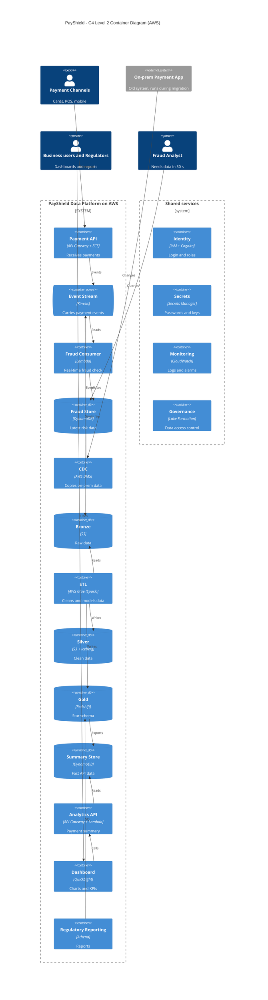

# Task 1 - Architecture & Cloud Design

**Cloud chosen: AWS**

## C4 Level 2 Container Diagram

## AWS Services

| Capability | AWS Service |
|---|---|
| Compute | ECS Fargate, Lambda |
| Storage | S3 |
| Streaming | Kinesis Data Streams |
| Lakehouse | Glue, Iceberg, Athena |
| Warehouse | Redshift |
| API | API Gateway |
| Identity | IAM, Cognito |
| Secrets | Secrets Manager |
| Monitoring | CloudWatch |
| Governance | Lake Formation |

## Why this architecture fits

- **Speed:** payments go into Kinesis and the fraud Lambda reads them in about 1-2 seconds, well under 30 seconds.
- **Scale:** Kinesis, Lambda and ECS scale automatically from 500 to 5,000 transactions/sec.
- **History:** S3 is cheap for 7 years. Iceberg keeps old versions, so old reports can be re-run.
- **Fast API:** the API reads a small summary table in DynamoDB, so it answers in under 500 ms.
- **Safe migration:** DMS copies data from the old system, so both can run together.
