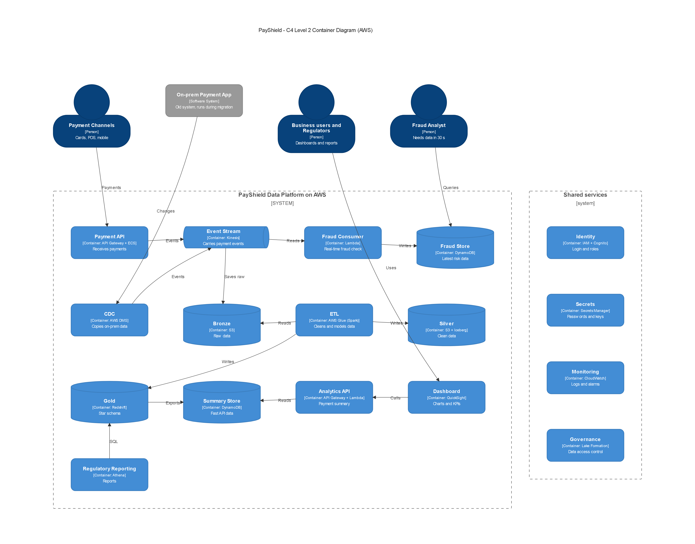
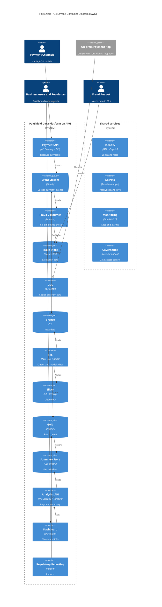

# Task 1 - Architecture & Cloud Design

## What was asked

- Design the new target architecture for PayShield.
- Draw a **C4 Level 2 Container Diagram** covering: Payment Channels → Payment API → Streaming → Bronze → Silver → Gold → Analytics API → Dashboard.
- Show compute, storage, streaming, lakehouse, API layer, identity, secrets, monitoring and governance.
- Choose **AWS or Azure** and map at least 8 services.
- Explain **why** the architecture fits the workload.

**Cloud chosen: AWS**

## The problem with the current system

| Problem | Cause |
|---|---|
| Fraud decisions are slow at peak | Data is copied by a batch job every 4 hours |
| Reports cannot be reproduced | Source data is changed after the report is made |
| Cannot handle peak load | Fixed on-prem servers cannot grow from 500 to 5,000 payments/sec |

## C4 Level 2 Container Diagram

## How data flows (step by step)

1. A customer pays with a card. The **Payment API** receives the payment.
2. The API puts a payment event into **Kinesis** (the stream).
3. **Fast path:** a **Lambda** reads each event within about 1 second, checks for fraud and writes the result to **DynamoDB**. Fraud analysts see it in seconds.
4. **Slow path:** the same events are saved to **Bronze** (S3) as raw data.
5. **AWS Glue** (Spark) cleans Bronze into **Silver** and builds the star schema in **Gold** (Redshift).
6. A small summary table is copied from Gold to DynamoDB. The **Analytics API** reads it and the **Dashboard** shows it.
7. **Regulatory reports** run on Gold with Athena.
8. During migration, **AWS DMS** copies changes from the old on-prem database into the same stream.

## AWS Services

| Capability | AWS Service | Why we use it |
|---|---|---|
| Compute | ECS Fargate, Lambda | No servers to manage, scales automatically |
| Storage | S3 | Very cheap, safe storage for 7 years |
| Streaming | Kinesis Data Streams | Handles thousands of events per second in real time |
| Lakehouse | Glue, Iceberg, Athena | Spark processing, table history, SQL on files |
| Warehouse | Redshift | Fast SQL for the star schema and reports |
| API | API Gateway | Login checks, rate limits, routes traffic |
| Identity | IAM, Cognito | Roles for services, login tokens for users |
| Secrets | Secrets Manager | Keeps passwords out of the code |
| Monitoring | CloudWatch | Logs, metrics and alarms |
| Governance | Lake Formation | Controls who can see which data |
| Migration | DMS, Direct Connect | Copies data from on-prem over a private link |

## Why this architecture fits

| Requirement | Target | How we meet it |
|---|---|---|
| Peak transactions | 5,000/sec | Kinesis, Lambda and ECS scale automatically |
| Fraud data | ≤ 30 sec | Stream + Lambda gives about 1-2 seconds |
| API response | ≤ 500 ms | API reads a small ready-made summary in DynamoDB |
| Availability | 99.9% | AWS services run in several data centres (Availability Zones) |
| Retention | 7 years | S3 storage, older data moved to cheaper Glacier |
| Deployment | Dev → Test → Prod | Separate AWS accounts built from the same code |
| Migration | No big-bang | DMS lets old and new systems run together |
| Rollback | Required | Old system stays live until the end |

## Why AWS (and not Azure)

Both could work. We chose AWS because:
- **Kinesis on-demand** grows by itself during payment spikes.
- **S3 + Iceberg** is cheap for 7 years and keeps old versions of tables, so old reports can be re-run.
- **DMS** makes it easy to copy data from the old system during migration.
