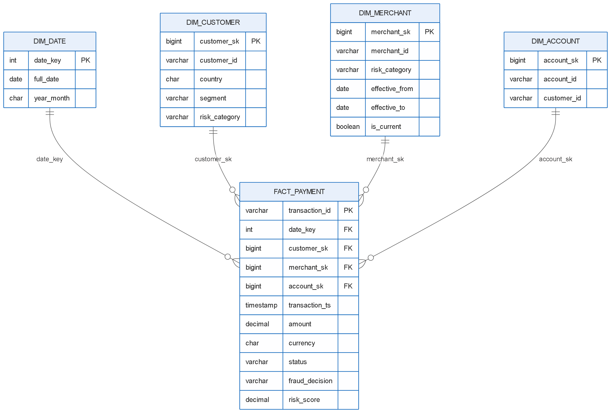

# Task 2 - Physical Data Model

## A. Star Schema

**FACT_PAYMENT grain = one payment transaction attempt.**



```sql
CREATE TABLE dim_date (
  date_key   INT PRIMARY KEY,        -- 20260214
  full_date  DATE NOT NULL,
  year_month CHAR(7) NOT NULL        -- 2026-02
);

CREATE TABLE dim_customer (
  customer_sk   BIGINT PRIMARY KEY,
  customer_id   VARCHAR(20) NOT NULL,
  country       CHAR(2) NOT NULL,
  segment       VARCHAR(10) CHECK (segment IN ('Retail','Premium','SME')),
  risk_category VARCHAR(6)  CHECK (risk_category IN ('LOW','MEDIUM','HIGH'))
);

CREATE TABLE dim_account (
  account_sk  BIGINT PRIMARY KEY,
  account_id  VARCHAR(20) NOT NULL UNIQUE,
  customer_id VARCHAR(20) NOT NULL
);

CREATE TABLE dim_merchant (             -- SCD Type 2
  merchant_sk    BIGINT PRIMARY KEY,
  merchant_id    VARCHAR(20) NOT NULL,
  risk_category  VARCHAR(6) NOT NULL,
  risk_score     DECIMAL(5,4),
  effective_from DATE NOT NULL,
  effective_to   DATE NOT NULL DEFAULT '9999-12-31',
  is_current     BOOLEAN NOT NULL
);

CREATE TABLE fact_payment (
  transaction_id VARCHAR(36) PRIMARY KEY,
  date_key       INT    NOT NULL REFERENCES dim_date(date_key),
  customer_sk    BIGINT NOT NULL REFERENCES dim_customer(customer_sk),
  merchant_sk    BIGINT NOT NULL REFERENCES dim_merchant(merchant_sk),
  account_sk     BIGINT NOT NULL REFERENCES dim_account(account_sk),
  transaction_ts TIMESTAMP NOT NULL,
  amount         DECIMAL(18,2) NOT NULL CHECK (amount >= 0),
  currency       CHAR(3) NOT NULL,
  status         VARCHAR(10) CHECK (status IN ('SUCCESS','FAILED','REVERSED')),
  fraud_decision VARCHAR(7)  CHECK (fraud_decision IN ('APPROVE','DECLINE')),
  risk_score     DECIMAL(5,4) CHECK (risk_score BETWEEN 0 AND 1)
);
```

**Partitioning / indexing**
- `fact_payment` partitioned by month of `transaction_ts`.
- Sort / cluster by `date_key` and `country` (most queries filter by these).
- Index on `dim_merchant (merchant_id, effective_from)` for fast lookups.

## B. Merchant Risk History - SCD Type 2

We use **SCD Type 2**. When the risk changes, the old row is closed and a new row is added. History is never lost.

| merchant_sk | merchant_id | risk | effective_from | effective_to |
|---|---|---|---|---|
| 1 | M100 | LOW | 2026-01-01 | 2026-03-31 |
| 2 | M100 | HIGH | 2026-04-01 | 2026-06-30 |
| 3 | M100 | MEDIUM | 2026-07-01 | 9999-12-31 |

A February transaction joins on the date range, so it gets **LOW** (not MEDIUM):

```sql
SELECT t.transaction_id, m.merchant_sk, m.risk_category
FROM payment_transaction t
JOIN dim_merchant m
  ON  m.merchant_id = t.merchant_id
  AND CAST(t.transaction_ts AS DATE) BETWEEN m.effective_from AND m.effective_to;
```

## C. Data Vault

```sql
CREATE TABLE hub_customer    (customer_hk CHAR(32) PRIMARY KEY, customer_id VARCHAR(20), load_ts TIMESTAMP, record_source VARCHAR(50));
CREATE TABLE hub_merchant    (merchant_hk CHAR(32) PRIMARY KEY, merchant_id VARCHAR(20), load_ts TIMESTAMP, record_source VARCHAR(50));
CREATE TABLE hub_transaction (transaction_hk CHAR(32) PRIMARY KEY, transaction_id VARCHAR(36), load_ts TIMESTAMP, record_source VARCHAR(50));

CREATE TABLE link_customer_transaction (link_hk CHAR(32) PRIMARY KEY, customer_hk CHAR(32), transaction_hk CHAR(32), load_ts TIMESTAMP, record_source VARCHAR(50));
CREATE TABLE link_merchant_transaction (link_hk CHAR(32) PRIMARY KEY, merchant_hk CHAR(32), transaction_hk CHAR(32), load_ts TIMESTAMP, record_source VARCHAR(50));

CREATE TABLE sat_customer    (customer_hk CHAR(32), load_ts TIMESTAMP, segment VARCHAR(10), risk_category VARCHAR(6), PRIMARY KEY (customer_hk, load_ts));
CREATE TABLE sat_merchant    (merchant_hk CHAR(32), load_ts TIMESTAMP, risk_category VARCHAR(6), risk_score DECIMAL(5,4), PRIMARY KEY (merchant_hk, load_ts));
CREATE TABLE sat_transaction (transaction_hk CHAR(32), load_ts TIMESTAMP, amount DECIMAL(18,2), status VARCHAR(10), PRIMARY KEY (transaction_hk, load_ts));
```

**Why Data Vault helps the bank**
- Data is only inserted, never updated, so the full history is kept for audit.
- Every row has `load_ts` and `record_source`, so we know when and where it came from.
- Old reports can be rebuilt exactly as they were.
