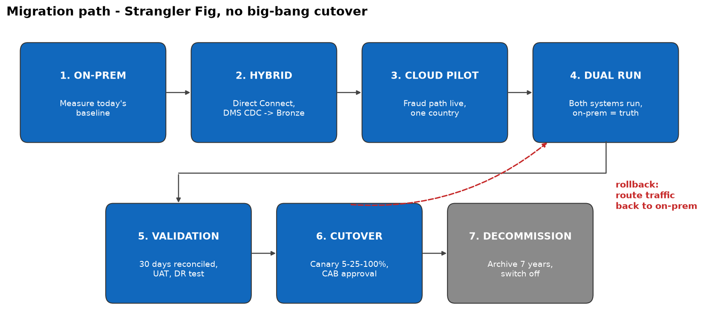

# Task 5 - Deployment & Migration Strategy

## What was asked

The old payment system cannot be switched off at once. Design a migration using a mix of: Greenfield, Hybrid, Strangler Fig, Rolling, Blue-green, Canary and Immutable infrastructure. Then define the sequence ON-PREM → HYBRID → CLOUD PILOT → DUAL RUN → VALIDATION → CUTOVER → DECOMMISSION, with cutover and rollback criteria, reconciliation, health checks, smoke tests, monitoring and who approves.

## The patterns and how we use them

| Pattern | Meaning | How we use it |
|---|---|---|
| Greenfield | Build new from scratch | Only for the new data platform on AWS |
| **Hybrid** | Old and new run together | On-prem and AWS are connected during the whole migration |
| **Strangler Fig** | Replace the old system piece by piece | Move Fraud first, then Reporting, then Finance, then payment intake |
| Rolling | Update servers a few at a time | For updating the Payment API servers |
| Blue-green | Two copies; switch between them | New releases can be switched back instantly |
| **Canary** | Send a small % of traffic first | 5% → 25% → 100% of API traffic |
| Immutable infrastructure | Replace servers, never patch them | Everything built from code (Terraform) |

**Our strategy:** Hybrid + Strangler Fig, with Canary for traffic and Blue-green for quick rollback. We do **not** use a big-bang cutover (switching everything in one day), because it is too risky for a bank.

## Migration sequence

| Phase | What happens | Move on when |
|---|---|---|
| 1. On-prem | Record current numbers (volumes, totals, speed) | Numbers agreed by Finance and Risk |
| 2. Hybrid | Connect on-prem to AWS (Direct Connect) and copy data with DMS | Data copied with less than 30 s delay |
| 3. Cloud pilot | Run fraud checks in AWS for one country | Fraud data ≤ 30 s at peak load |
| 4. Dual run | Both systems run for all countries; on-prem is still the main one | 30 days with matching results |
| 5. Validation | Compare everything, user testing, security testing | All teams sign off |
| 6. Cutover | Move traffic to AWS step by step (canary) | No problems at 100% |
| 7. Decommission | Archive old data (7 years) and switch off on-prem | Archive checked |

## Cutover and rollback

| Cutover criteria (all must be true) | Rollback criteria (any one) |
|---|---|
| Row counts match 100% | Totals don't match and can't be explained |
| Amount totals match | Fraud data slower than 30 s |
| Fraud data ≤ 30 s | API errors above 1% |
| API ≤ 500 ms | API slower than 500 ms for 15 minutes |
| 30 days of dual run without problems | A serious incident or data loss |

**How rollback works:** the on-prem system keeps running and receiving all payments until the very end. To roll back, we just send traffic back to it.

## Other checks

| Check | What we do |
|---|---|
| Data reconciliation | Every day, compare row counts and amount totals per day and country between on-prem and AWS |
| API health checks | `/health` endpoint checked every minute; unhealthy servers get no traffic |
| Smoke tests | After every deployment, call the API once and check the answer is correct |
| Monitoring | CloudWatch alarms for data delay, API errors, response time and cost |

## Who approves production cutover

The **CTO** gives the final approval, together with the **Change Advisory Board**:
- Head of Fraud Risk - fraud data is correct and fast
- Head of Regulatory Reporting / Compliance - reports match
- Finance Controller - settlement totals match
- CISO - security testing passed
